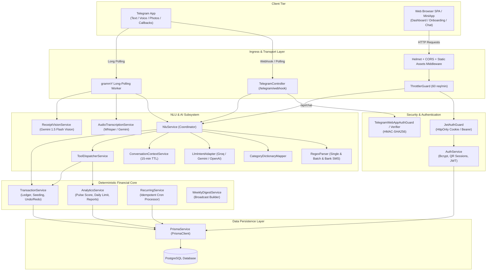
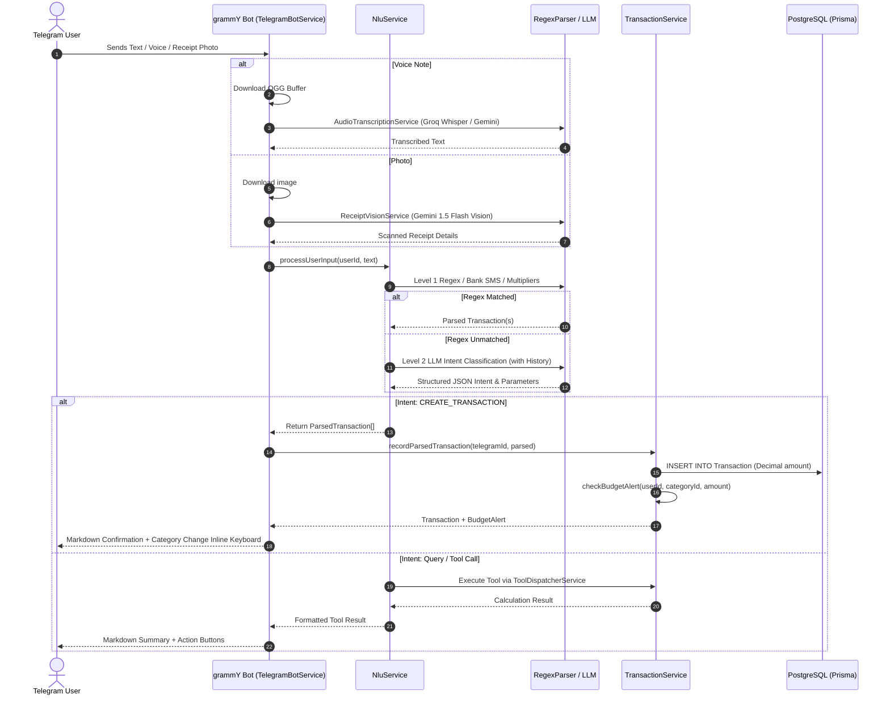
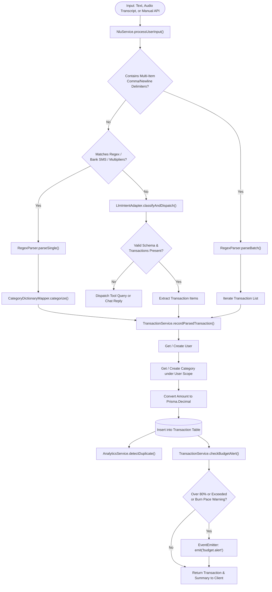
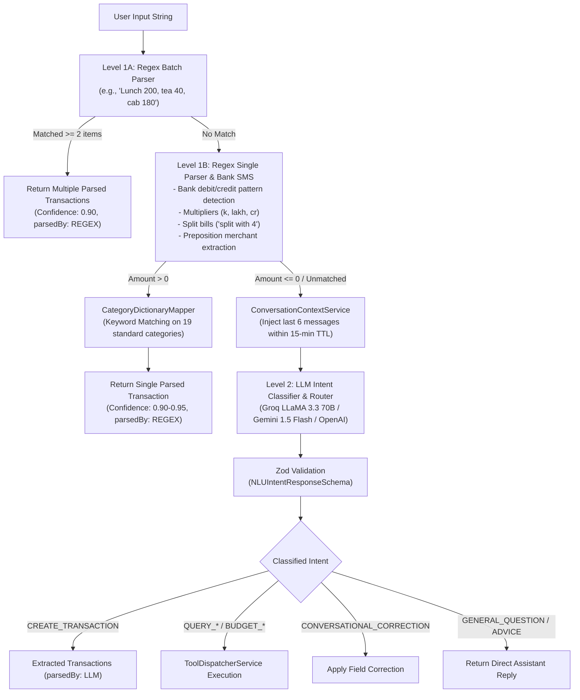
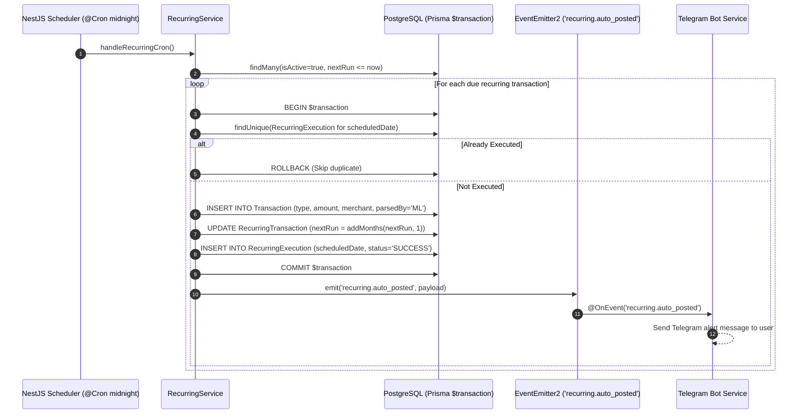
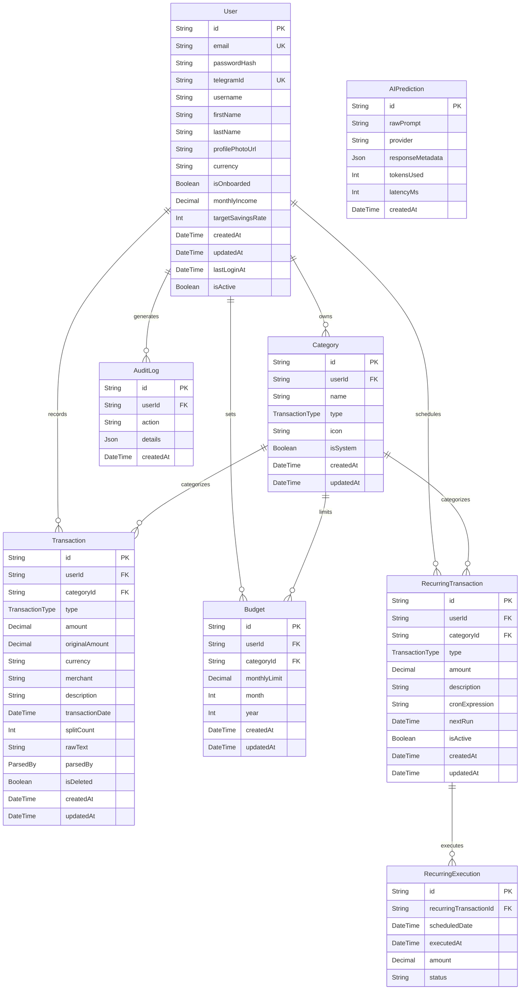

# PulseAI (Kinetiq Money) Architecture Documentation

> **Status:** Current Production Architecture  
> **Framework:** NestJS 11 (TypeScript)  
> **Database:** PostgreSQL (Prisma ORM 5.22)  
> **Bot Platform:** Telegram (grammY 1.45)  
> **Web Client:** Single-Page Application (Vanilla JS / Tailwind CSS / Chart.js)

---

## Table of Contents

1. [System Overview](#1-system-overview)
2. [Component Architecture Diagram](#2-component-architecture-diagram)
3. [Request Flow](#3-request-flow)
4. [Telegram Message Flow](#4-telegram-message-flow)
5. [Web API Flow](#5-web-api-flow)
6. [Authentication Flow](#6-authentication-flow)
7. [Transaction Creation Flow](#7-transaction-creation-flow)
8. [AI / NLU Flow](#8-ai--nlu-flow)
9. [Budget Flow & Pacing Engine](#9-budget-flow--pacing-engine)
10. [Recurring Transaction Flow](#10-recurring-transaction-flow)
11. [Database Architecture](#11-database-architecture)
12. [Scheduler Architecture](#12-scheduler-architecture)
13. [Dashboard Architecture](#13-dashboard-architecture)

---

## 1. System Overview

PulseAI is a personal financial intelligence platform operating on a **modular monolith** pattern. It provides automated income and expense tracking, conversational querying, receipt scanning, voice expense capture, deterministic budget pace tracking, and scheduled cash flow automation.

### Key Tenet
> **AI decides what the user means; deterministic backend code decides what actually happens.**

The system is split into two interaction tiers connecting to a shared domain layer:
* **Telegram Interface**: Handles text messages, voice notes, bill photos, inline interactive callbacks, and persistent menu keyboards via `grammy`.
* **Web Dashboard & REST API**: Handles web sessions, onboarding, visual interactive analytics, manual entries, budget configuration, and CSV exports.
* **Internal Event Bus**: Uses `@nestjs/event-emitter` for asynchronous domain notifications (`budget.alert`, `recurring.auto_posted`, `weekly.digest.ready`).

---

## 2. Component Architecture Diagram



---

## 3. Request Flow

### Standard Ingress Pipeline
1. **HTTP Requests** arrive at `main.ts` / Express:
   - Security headers enforced via `helmet({ contentSecurityPolicy: false })`.
   - CORS validation applied via `CORS_ORIGIN`.
   - Static files served from `/public`.
2. **Rate Limiting**: `ThrottlerGuard` enforces a global limit of 60 requests/minute per IP address.
3. **Authentication**:
   - Protected routes pass through `JwtAuthGuard` (extracting `pulse_session` HttpOnly cookie or `Authorization` Bearer token).
   - Semi-protected endpoints (e.g. `/api/chat`) pass through `OptionalJwtAuthGuard`.
   - Telegram webhooks pass through `TelegramWebhookGuard` verifying `x-telegram-bot-api-secret-token`.
4. **Controller Handling**: Controllers invoke domain services with authenticated `user.id`.
5. **Database Transaction / Query**: `PrismaService` executes SQL queries against PostgreSQL.

---

## 4. Telegram Message Flow

The Telegram interface (`TelegramBotService`) processes inputs based on update types:



---

## 5. Web API Flow

The web application communicates with the backend via REST endpoints located under `/api/*` and `/analytics/*`:

| Endpoint | Method | Guard | Description |
| :--- | :--- | :--- | :--- |
| `/api/auth/register` | `POST` | Public | Register with email + password (hashed with bcrypt). |
| `/api/auth/login` | `POST` | Public | Authenticate with email + password, issues `pulse_session` cookie. |
| `/api/auth/telegram` | `POST` | Public | Authenticate via Telegram Login Widget HMAC signature. |
| `/api/auth/qr/generate` | `GET` | Public | Generates a 5-minute QR login session with Telegram deep link. |
| `/api/auth/qr/status` | `GET` | Public | Polls QR session approval status and sets cookie when approved. |
| `/api/auth/logout` | `POST` | Public | Clears `pulse_session` cookie. |
| `/api/me` | `GET` | `JwtAuthGuard` | Returns authenticated user profile and settings. |
| `/api/user/onboarding` | `POST` | `JwtAuthGuard` | Saves onboarding income, currency, savings target, and initial budgets. |
| `/api/chat` | `POST` | `OptionalJwtAuthGuard` | Natural language chat input for web dashboard users. |
| `/api/transactions` | `GET` | `JwtAuthGuard` | Returns dashboard aggregates, period summaries, and recent transactions. |
| `/api/transactions` | `POST` | `JwtAuthGuard` | Manual transaction creation. |
| `/api/transactions/:id` | `DELETE` | `JwtAuthGuard` | Soft-deletes a transaction owned by the user. |
| `/api/budgets` | `GET` | `JwtAuthGuard` | Retrieves monthly category budget limits. |
| `/api/budgets` | `POST` | `JwtAuthGuard` | Upserts a monthly category budget limit. |
| `/api/recurring` | `GET` | `JwtAuthGuard` | Retrieves active recurring rules. |
| `/api/recurring` | `POST` | `JwtAuthGuard` | Creates a new recurring scheduled payment rule. |
| `/api/export/csv` | `GET` | `JwtAuthGuard` | Exports user transactions as a sanitized CSV file. |
| `/health` | `GET` | Public | Health check reporting DB status, uptime, and memory usage. |

---

## 6. Authentication Flow

```mermaid
sequenceDiagram
    autonumber
    actor User as User / Browser
    participant AuthC as AuthController
    participant AuthS as AuthService
    participant Bot as Telegram Bot
    participant DB as PostgreSQL (Prisma)

    alt Scenario A: Email & Password
        User->>AuthC: POST /api/auth/login { email, password }
        AuthC->>AuthS: loginWithEmail(email, pass)
        AuthS->>DB: findUnique(user)
        AuthS->>AuthS: bcrypt.compare(password, hash)
        AuthS-->>AuthC: JWT Token + User Profile
        AuthC-->>User: Set-Cookie: pulse_session=<token>; HttpOnly
    else Scenario B: Telegram Widget
        User->>AuthC: POST /api/auth/telegram { id, hash, auth_date, ... }
        AuthC->>AuthS: validateAndLoginTelegramUser(data)
        AuthS->>AuthS: HMAC-SHA256(botToken, dataCheckString) == hash
        AuthS->>DB: Upsert User by telegramId
        AuthS-->>AuthC: JWT Token + User Profile
        AuthC-->>User: Set-Cookie: pulse_session=<token>; HttpOnly
    else Scenario C: Desktop QR Code Login
        User->>AuthC: GET /api/auth/qr/generate
        AuthC->>AuthS: createQrSession()
        AuthS-->>User: { sessionId, deepLink: "https://t.me/bot?start=qr_xxx" }
        User->>Bot: Opens deep link on phone & sends /start qr_xxx
        Bot->>AuthS: approveQrSession(sessionId, telegramId)
        AuthS->>AuthS: Update session status to 'APPROVED' & attach token
        User->>AuthC: GET /api/auth/qr/status?sessionId=xxx (Polling)
        AuthC-->>User: Set-Cookie: pulse_session=<token> & Authenticated!
    end
```

---

## 7. Transaction Creation Flow



---

## 8. AI / NLU Flow

The NLU subsystem is structured in multi-tier cascading stages to minimize LLM latency and cost while maintaining high parsing precision:



---

## 9. Budget Flow & Pacing Engine

Budget management operates entirely with deterministic domain rules in `TransactionService` and `AnalyticsService`:

1. **Budget Definition**:
   - Monthly limit configured per category per month/year via `prisma.budget.upsert()`.
2. **Current Spend Aggregation**:
   - Sums all active (`isDeleted: false`), expense transactions within UTC month bounds.
3. **Pace & Run-Rate Formula**:
   $$\text{usedPercentage} = \frac{\text{currentSpent}}{\text{monthlyLimit}} \times 100$$
   $$\text{expectedPacePercentage} = \left(\frac{\text{currentDay}}{\text{totalDaysInMonth}}\right) \times 100$$
   - **Pace Warning Condition**: Triggers if $\text{usedPercentage} > (\text{expectedPacePercentage} + 20\%)$ before the limit is reached.
   - **Month-End Projection**:
     $$\text{projectedMonthEndSpend} = \left(\frac{\text{currentSpent}}{\text{currentDay}}\right) \times \text{totalDaysInMonth}$$
     $$\text{projectedOverage} = \text{projectedMonthEndSpend} - \text{monthlyLimit}$$
4. **Proactive Event Trigger**:
   - Emits `budget.alert` event when spend $\ge 80\%$ or when the pace formula projects an overage.

---

## 10. Recurring Transaction Flow

Recurring transactions (e.g. SIPs, subscriptions, salaries, rent) run through an **idempotent transactional scheduler**:



---

## 11. Database Architecture

### Entity Relationship Diagram



---

## 12. Scheduler Architecture

The application uses `@nestjs/schedule` for background cron routines:

| Cron Job | Schedule | Service | Responsibility |
| :--- | :--- | :--- | :--- |
| **Recurring Outlay Processor** | `0 0 * * *`<br/>(Daily at Midnight) | [`RecurringService`](file:///d:/Akash%20Saas%20Projects/Ai%20Expense%20Tracker/src/analytics/recurring.service.ts) | Queries due recurring records, creates ledger transactions atomically, increments `nextRun` by 1 month, logs execution records, and emits notification events. |
| **Weekly Money Digest** | `0 20 * * 0`<br/>(Every Sunday at 8:00 PM) | [`WeeklyDigestService`](file:///d:/Akash%20Saas%20Projects/Ai%20Expense%20Tracker/src/analytics/weekly-digest.service.ts) | Computes 7-day totals, net savings, Pulse Score, and top 3 expense categories for all active Telegram users, emitting `weekly.digest.ready` events. |

---

## 13. Dashboard Architecture

The Web Dashboard is implemented as a client-side single page application inside [`public/index.html`](file:///d:/Akash%20Saas%20Projects/Ai%20Expense%20Tracker/public/index.html) integrating with backend REST endpoints:

### Frontend Subsystems
1. **State & Session Store**:
   - Manages active user profiles, authenticated sessions, theme preferences (`dark`/`light`), and live dashboard caches.
2. **Interactive Charting (Chart.js)**:
   - Renders weekly spend vs. income trend bars, category allocation donuts, and monthly burn progression.
3. **Financial Intelligence Widgets**:
   - **Pulse Health Score Gauge (0–100)**: Evaluates retention rate and budget discipline into a graded indicator (`Excellent`, `Good`, `Fair`, `At Risk`).
   - **Safe Daily Spend Card**: Real-time formula dividing remaining discretionary budget by remaining days in month.
4. **Interactive AI Assistant Panel**:
   - Inline conversation interface communicating with `POST /api/chat`, supporting natural language queries and instant transaction logging.
5. **Interactive Controls**:
   - Category budget limit editor, recurring payment creation modal, transaction soft-deletion, and one-click CSV export download.
